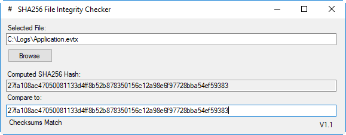

# SHA256 GUI

Computes the SHA256 hash of a selected file and compares to the pasted hash in the 2nd field.  Files can also be dragged onto the window and the hash will be computed.

Compiles with Visual Studio 2015 targeting .NET framework 3.5

# License

This project is licensed under the MIT License - see the LICENSE file for details
